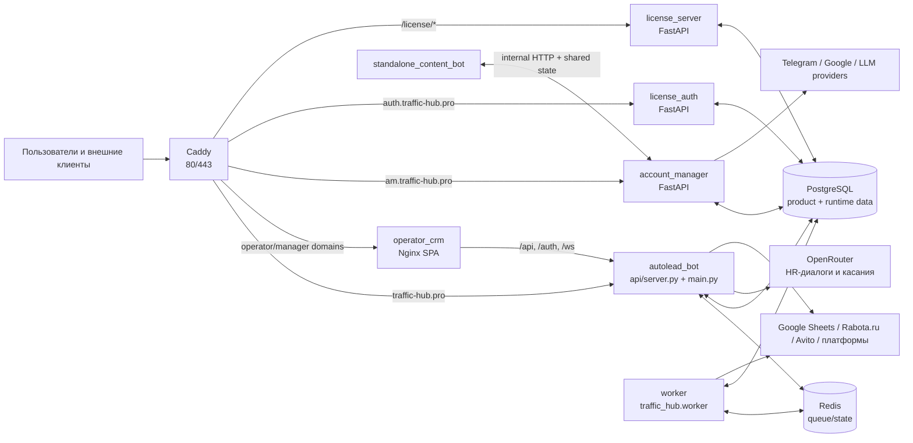

# Карта контейнеров и модулей

Актуально на 2026-07-17. Источник: live containers, `docker-compose.yml`, `deploy/Caddyfile` и product commit `fd392b408`.

## Контейнеры

## Границы модулей

| Контур | Точки входа | Назначение | Зависимости |
|---|---|---|---|
| Autolead UI/API | `main.py` → `api/server.py` | HTML dashboard, `/api/*`, auth/session, WebSocket logs/status, legacy Autolead flow | `api/routers`, `services`, `utils`, `traffic_hub` |
| Traffic core | `traffic_hub/app.py` | `/traffic-api/*`: leads, offers, tracking, postbacks, finance, funnels, integrations, HR agent, tools | SQLAlchemy models, `traffic_hub/services`, PostgreSQL |
| Job execution | `traffic_hub/worker.py`, `job_process.py`, `services/job_queue.py`, `services/job_runner.py` | Redis queue, owner-scoped scheduling, process isolation jobs | Redis, PostgreSQL runtime stores, external platforms |
| Runtime persistence | `utils/runtime_store_pg_*.py`, `utils/control_store.py`, `utils/runtime_repository.py` | Logs, jobs, leads, delivery, control sync, settings | PostgreSQL; legacy SQLite only compatibility surface |
| Account Manager | `AccountManager/api/main.py` + routers/services | Accounts, proxies, Telegram, Google, content, gateway, HR API | отдельный DB URL, external services, shared runtime state |
| License | `license_auth/app.py`, `license_server/app.py` | external auth/OAuth-like token flow, activation keys | PostgreSQL, signing keys |
| Content / AI | `standalone_content_bot/app.py`, `traffic_hub/hr_agent/service.py` | Контентный Telegram bot; HR-диалоги и касания через OpenRouter внутри основного приложения | Account Manager internal API/state, PostgreSQL, Redis, OpenRouter |

## Важная граница

`autolead_bot` — не только один API. Он объединяет legacy `api/server.py` и registration нового `traffic_hub` core. Это ускоряет интеграцию, но размывает ownership, расширяет blast radius deploy и усложняет поиск точки входа. Для дебага сначала классифицировать запрос как `/api/*` или `/traffic-api/*`.

## Подтверждённые performance signals

- `control_user_app_configs` читался 362 538 раз с суммарным временем ~1 064 s в `pg_stat_statements`.
- `autolead_app_log` читался 119 806 раз и вернул ~54 млн строк суммарно; UI log/history требует page/limit/retention discipline.
- Полный выборочный запрос leads в среднем занимал ~122 ms и вернул более 3 млн строк суммарно; для UI нужны pagination, projection и индексы по owner/time.
- `postback_logs` — крупнейшая таблица: 57 MB из DB около 105 MB; retention и агрегирование должны быть явными.

## Связанные заметки

- [[02_Код/Архитектура/Обзор системы]]
- [[02_Код/Архитектура/Потоки данных]]
- [[02_Код/Эксплуатация/Развёртывание]]
- [[03_Ошибки/Расследования/2026-07-15 карта контейнеров и модулей]]
