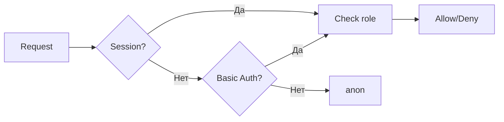

# Авторизация

Файл: `api/authz.py` (139 строк)

## Уровни доступа

| Роль | Права |
|------|-------|
| `admin` | Полный доступ |
| `operator` | Ограниченные деструктивные операции |
| `unauthenticated` | Только health/public endpoints |

## Методы аутентификации

1. **Session cookie** — для браузера (Starlette SessionMiddleware)
2. **HTTP Basic Auth** — для API и WebSocket

## RBAC

## Связанное

- [[05-Configuration/Config|Конфигурация]]
- [[04-Database/control|control.db]]
