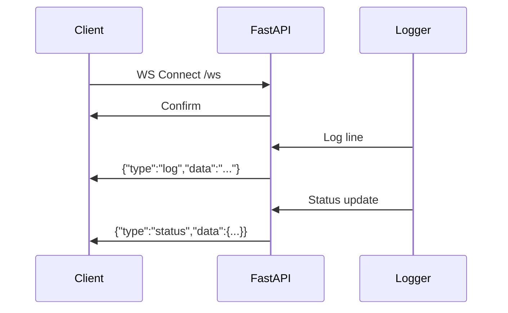

# WebSocket

Файл: `api/ws_manager.py` (94 строки)

## Endpoint

```
ws://localhost:8080/ws
```

## Назначение

- Трансляция логов в реальном времени
- Статус выполнения задач
- Push-уведомления дашборду

## Схема



## Связанное

- [[03-API/Overview|API Overview]]
- [[06-Deployment/Docker|Docker]]
