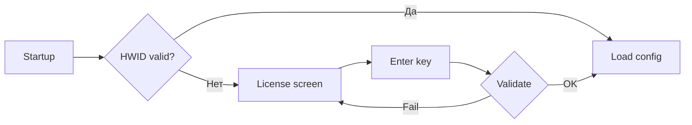

# Лицензирование

Файл: `utils/license.py` (~1300 строк)

## Механизм

- **HWID** — аппаратный ID (железо + софт).
- **Control store** — таблица `license_users` в `control.db`.
- **Google Sheets fallback** — если control store недоступен.

## Процесс

## Утилиты

| Файл | Описание |
|------|----------|
| `ActivateLicense.exe` | Активатор лицензии (Windows) |
| `LicenseKeygen.exe` | Standalone WinForms-генератор ключей; UI и палитра задаются прямо в `LicenseKeygen.cs`, генерация ключа идёт через `POST {license-api}/keys/create` |
| `pack_license_sa.py` | Упаковка service_account.json в ZIP |

## LicenseKeygen

- Подтверждено по `LicenseKeygen.cs`: форма `KeygenForm` собирает UI вручную, без designer-файлов и без отдельного frontend bundle.
- Подтверждено по `LicenseKeygen.csproj`: у проекта нет `ApplicationIcon`; иконка формы сейчас задаётся программно в коде.
- Клиент читает API URL из `TRAFFICHUB_LICENSE_API_URL` или `license_keygen.config.json`; по умолчанию использует `https://traffic-hubcrm.ru/license-api`.
- Авторизация в API идёт заголовком `X-API-Key`; ключ берётся из `TRAFFICHUB_LICENSE_API_KEY` или `license_keygen.config.json`.
- После синхронизации с activation flow `LicenseKeygen` больше не спрашивает логин: key выпускается по роли, а логин задаётся конечным пользователем на `/register`.
- `license_server /keys/create` теперь добавляет в signed payload серверно-сгенерированный `password`; это нужно, потому что `_apply_activate_license_key(...)` в основном сервере требует пароль внутри activation key.
- Для совместимости со старым удалённым `license-api` клиент временно отправляет технический `pending_*` логин, если сервер всё ещё валидирует `login` как обязательное поле.

## Связанное

- [[04-Database/control|control.db]]
- [[03-API/Auth|Авторизация]]
- [[2026-06-12 LicenseKeygen UI и иконка]]
- [[2026-06-12 LicenseKeygen и activation flow]]
