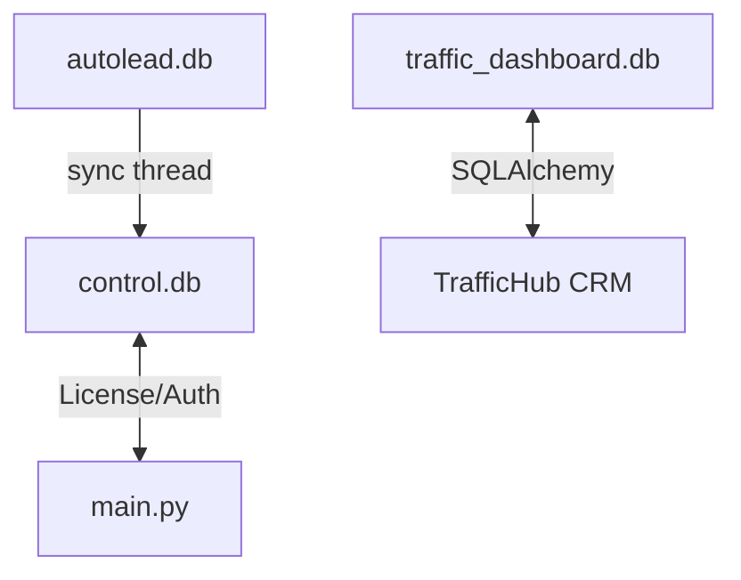

# Схема БД

Проект использует **три изолированных SQLite базы**:

```
autolead.db  ← основные данные (лиды, история)
control.db   ← пользователи, конфиг, лицензии
traffic_dashboard.db  ← CRM данные
```

## Связь



Mermaid-диаграммы схем каждого файла — в соответствующих заметках.

## Связанное

- [[материалы/документы/TrafficHub-obsidian/04-Database/autolead|autolead.db]]
- [[материалы/документы/TrafficHub-obsidian/04-Database/control|control.db]]
- [[материалы/документы/TrafficHub-obsidian/04-Database/traffic|traffic_dashboard.db]]
