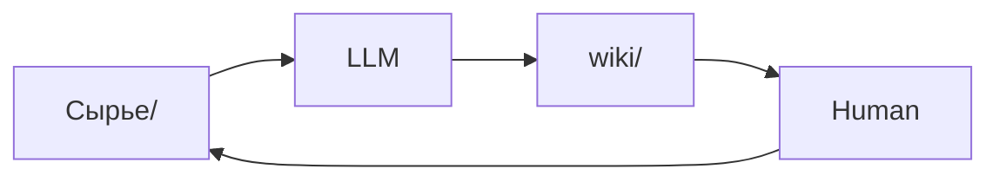

# 🛠️ Инструменты

Экосистема инструментов вокруг LLM Wiki. Все опциональны — выбирай по потребности.

---

## Obsidian Web Clipper

**Что**: браузерное расширение
**Зачем**: конвертирует веб-страницы в markdown одним кликом

Установка: [obsidian.md/clipper](https://obsidian.md/clipper)

Workflow:
1. Открыл статью в браузере
2. Нажал расширение → markdown сохранился в `Сырье/`
3. Сказал LLM: «обработай новый файл в Сырье/»

> Комбо с `Ctrl+Shift+D` (скачать вложения): текст + картинки сразу оседают локально.

---

## qmd — локальный поиск по markdown

**Что**: локальный поисковик для markdown-файлов
**Зачем**: когда index.md уже не справляется (~100+ источников)
**GitHub**: https://github.com/tobi/qmd

Возможности:
- Гибридный поиск: BM25 + векторный
- LLM re-ranking результатов
- Всё on-device, никакого облака
- **CLI** — LLM может вызывать через shell
- **MCP server** — LLM может использовать как нативный инструмент

```bash
# Пример использования
qmd search "механизм внимания в трансформерах"
```

---

## Marp — слайды из markdown

**Что**: формат markdown-слайдов + Obsidian-плагин
**Зачем**: генерировать презентации прямо из wiki-контента

Ссылка: https://marp.app

Workflow:
1. Задал LLM вопрос → получил хороший ответ
2. LLM сохраняет как Marp-файл в `Синтез/`
3. Открываешь в Obsidian → готовые слайды

---

## Dataview — динамические запросы

**Что**: Obsidian-плагин
**Зачем**: генерировать динамические таблицы из YAML frontmatter

Установка: через Community Plugins в Obsidian

Пример: если LLM добавляет к страницам frontmatter с `tags`, `created`, `sources` — Dataview строит живые таблицы:

~~~markdown
```dataview
TABLE created, sources
FROM "wiki/concepts"
SORT created DESC
```
~~~

Результат: таблица всех концептуальных страниц, отсортированных по дате.

---

## Git — версионирование wiki

**Что**: стандартный git
**Зачем**: wiki — это просто директория markdown-файлов

Что получаешь бесплатно:
- История изменений каждой страницы
- Возможность откатиться
- Ветки для экспериментов
- Коллаборация (если нужна)

```bash
# Инициализация
git init
git add .
git commit -m "init wiki"

# После каждой сессии
git add wiki/
git commit -m "[2026-04-16] ingest: статья про трансформеры"
```

---

## matplotlib / mermaid — визуализация

**Что**: библиотека Python / синтаксис диаграмм в markdown
**Зачем**: визуальные ответы на query

LLM может генерировать:
- Графики трендов (matplotlib)
- Диаграммы связей (mermaid)
- Временные линии

Пример mermaid прямо в wiki:



---

## Связанные страницы

- [[материалы/документы/legacy-vault/11_Операционный контур/03 Обучение/ЛЛМ и тексты/Сущности/obsidian|Obsidian — основной IDE]]
- [[материалы/документы/legacy-vault/11_Операционный контур/03 Обучение/ЛЛМ и тексты/Понятия/operatsii|Операции: Query — форматы ответов]]
- [[материалы/документы/legacy-vault/11_Операционный контур/03 Обучение/ЛЛМ и тексты/Понятия/indeksirovanie-i-logirovanie|Индексирование: когда нужен qmd]]

